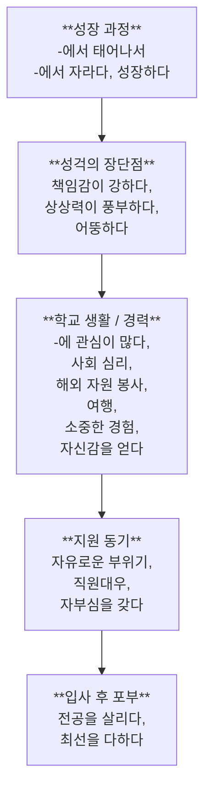

# 153
## 꼭 일해 보고 싶은 직장이 있습니까? 어떤 곳입니까?
#### 자기 소개서는 자신을 광고하는 글입니다. 자기 소개서에는 어떤 내용을 씁니까?
- [ ] 성장 과정
- [ ] 성격의 장단점
- [ ] 학교 생활
- [ ] 군대 생활
- [ ] 경력
- [ ] 지원 동기
- [ ] 포부
- [ ] <ins>__</ins>

# 154
## 소영 씨가 제일 기획에 인턴 사원으로 지원한 동기는 무엇입니까?
### 자기 소개서
#### 성장 과정
저는 광주에서 태어나서 대전에서 자랐습니다. 아버지는 전형적인 한국 남자로 일을 중요하게 생각하는 분이십니다. 하지만 바쁘신 중에도 자녀 교육에 많은 관심을 가지셨고 대화를 통해서 저를 늘 격려해 주셨습니다. 어머니는 고등학교 선생님이신데 이해심이 많고 따뜻한 분이십니다. 이런 부모님 덕분에 저는 큰 어려움 없이 성장할 수 있었습니다.
#### 성경의 장단점
저는 성격이 밝고 매사에 적극적입니다. 책임감이 강해서 맡은 일을 끝까지 다 합니다. 다만 저는 상상력이 풍부해서 주위 사람들에게서 엉뚱하다는 말을 듣기도 합니다.
#### 학교 생활 및 경력
저는 사람의 마음에 관심이 많아서 중-고등학교 때부터 심리학 책을 많이 읽었습니다. 특히 사회 심리에 관심이 많아서 대학에서 심리학을 전공하게 됐습니다. 나중에 졸업 논문은 ⌜사회 심리와 상품 광고의 관련성⌟에 대해서 쓰려고 합니다.

대학 2학년 때 해외 자원 봉사자로 베트남에서 6개월 동안 컴퓨터를 가르쳤습니다. 그리고 한국에 돌아오기 전에 2개월 동안 캄보이아, 라오스, 태국, 미얀마 등을 여행했는데 자원봉사 활동과 여행은 제 인생에서 가장 소중한 경험이었습니다. 저는 그 경험을 통해서 자신을 더 잘 알게 되었고 자신감을 얻게 되었습니다.
#### 지원 동기 및 입사 후 포부
제일 기획에 지원한 가장 큰 이유는 제일 기획의 자유로운 분위기가 저와 잘 맞을 것 같다고 생각했기 때문입니다. 또한 직원 대우가 좋고 직원들이 회사에 자부심을 갖고 일한다고 들었습니다. 저도 그런 회사에서 일하면서 제 능력을 인정받고 싶습니다. 제일 기획에서 일하게 된다면 제 전공을 살려서 회사 일에 많은 도움이 될 수 있도록 최선을 다해서 열심히 일하겠습니다. 감사합니다.
# 155
## 가
### 맞으면 O, 틀리면 X 하십시오
1. 소영 씨의 아버지는 바쁘셔서 소영 씨에게 관심을 가져 주지 못했다
	1. 틀리다, 아무리 바쁘도 관심을 많다고 했다
2. 소영 씨는 밝고 적극적이지만 책입감은 부족한 편이다
	1. O
3. 소영 씨는 광고에 관심이 많아서 대학에서 광고를 전공한다
	1. 틀리다. 소영 씨는 사람의 마음에 관심이 많아서 심리학을 저공하게 됐다
4. 소영 씨는 6개월 동안 베트남을 여행한 경험이 있다
	1. 하긴, 해외 자원 봉사자로 일하는 것을 여행하는 것과 비슷하다고 생각한다면 다행이긴 한데 소영 씨는 6개월 동안 컴퓨터를 가르쳤다 
5. 제일 기획은 분위기가 자유롭고 직원 대우가 좋다
	1. O
## 나
### 묻고 대답하십시오
1. 소영 씨 부모님은 어떤 분이십니까?
	1. 전형적인 남자로써 일을 가장 중요하게 생각하는 분입니다.
2. 소영 씨 성격은 어떻습니까?
	1. 매사 저극적인 여자 인데 소영 씨 성격이 밝고 책임감이 강해서 맡은 일 끝까지 다 하고 상상력이 풍부합니다.
3. 소영 씨는 왜 심리학을 전공합니까?
	1. 사람의 마음에 관심이 많아서 심리학 책을 읽고 사회 심리에 관심이 많아서 대학에서 심리학을 전공하게 됐습니다.
4. 소영 씨는 대학 2학년 때 어떤 경험을 했습니다
	1. 해외 자원 봉사자로 베트남와 다른 동남아시아 나라에서 자원봉사 활동과 여행은 제 인생에서 가장 소중한 경험였습니다.
5. 소영 씨는 제일 기획에서 일하게 되면 어떻게 하겠다고 포부를 말했습니까?
	1. 전공을 살려서 회사 일에 많은 도움이 될 수 있게 최선을 다해서 일하겠다고 말했습니다.
## 다
### 다음 단어와 표현을 이용해서 읽은 내용을 말해 보십시오

소영 씨는 광주에서 태어나서 대전에서 자랐습니다. 이해심을 많고 격려한 부모님 덕분에 소영 씨가 어려움 없이 성장할 수 있었다고 했습니다.

소영 씨는 책임감이 강해서 맡은 일 끝까지 다 하고 상상력이 풍부해서 주위 사람들에게서 엉뚱하다는 말을 듣기도 했다고 했습니다.

소영 씨는 사람의 마음에 관심이 많아서 심리학 책을 많이 읽고 특히 사회 심리에 관심이 만아서 심리학을 전공하게 됐다고 말하고 대학 2학년 때 해외 자원 보사자로 동남 아시아 가는데 자원보사 활동과 여행은 제 인생에서 소중한 경험이라고 했는데 또한 경럼으로 자신감을 얻게 된다고 했습니다.

소영 씨는 제일 기획에 지원한 이유는 제일 기획의 자유로운 분위기가 저와 잘 맞을 것 같고 직원 대우가 좋다고 하고 직원들이 자부심을 갖고 일한다고 들었습니다.

소영 씨는 전공을 살려서 회사 일에 많은 도움이 될 수 있도록 최선을 다하겠다고 했습니다.
# 156
## 라
### 해 봅시다
#### 여러분의 자기 소개서에는 어떤 내용이 들어갈까요? 같이 이야기해 보세요
* 성장 과정
* 성격의 장단점
* 학교 생활 / 전공
* 경력 및 기타 경험
* 지원 동기 및 입사 후 포부
## 마
### 써 봅시다
#### '라'에서 이야기한 내용으로 자기 소개서를 쓰세요
나는 에라배마에서 태어나고 자랐습니다. 성장할 때 부모님은 쉽게 살 수 있도록 과외 선생님을 붙여주셨습니다. 어렸을 때 내가 글을 잘 못 읽어서 과외 선생님께서 도움을 많이 받았습니다.

내향적인 사람으로서 집도리처럼 살고 싶은데 까금 다른 분은 내가 무례한 사람이라고 생각하지만 예기해 보면 나는 그냥 내성적인 남자 입니다. 또한, 토론 할 때 강하게 말 하지 않아서 자신감이 없는 것 같습니다.

대학교 단닐 때 소프트웨어 엔지니어를 전공하게 됐습니다.