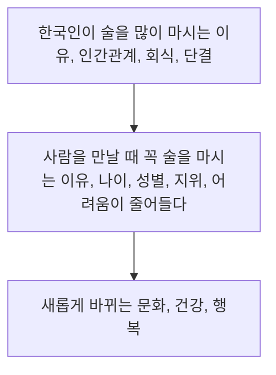

# 89
# 90
## 가 
### 맞으면 O, 틀리면 X, 알 수 없으면 △ 하십시오
1. 모든 한국 사람은 술을 좋아하기 때문에 많이 마신다
	1. X, 가끔 마시고 싶어서 마시는 게 아니라고 하지만 단결을 중요하게 생각해서 회식을 많이 하게 된다고 했어요 
2. 한국 사람은 인간관계보다는 일을 먼저 생각한다
	1. X, 대신에 한국 사람은 일보다는 인간관계를 먼저 생각한다고 했어요
3. 한국에는 나이, 성별, 지위 때문에 지켜야 할 규칙이 많다
	1. O
4. 한국은 요즘 다른 사람들과 함께 술을 마시는 사람이 늘고 있다
	1. X, 사실히 한국 사람들은 '우리'를 먼저 생각하는 문화 오히려 '개인'을 먼저 생각하는 문화로 바뀌고 있다고 했어요
5. 최근에는 가족과 함께 여행을 떠나는 한국 사람들이 많아졌다
	1. △ - `¯\_(ツ)_/¯`
# 91
## 나
### 묻고 대답하십시오
1. 이 글은 인터뷰 기사입니다. 인터뷰 주제가 뭐예요?
	1. 이 인터뷰의 주게가 '술 권하는 사회'입니다.
2. 한국에서는 왜 술을 마실 기회가 많다고 해요?
	1. 왜냐하면, 한국 사회는 인간관게 중요하게 생각해서 직장에서도 일보다 관계를 먼저 생각하는데 불가피하게 술을 마시려고 간다고 해요
3. 한국 사람들에게 술을 마시는 이유를 물으면 뭐라고 대답한다고 해요?
	1. 
4. 한국 사람들은 사람들을 만날 때 왜 꼭 술을 마신다고 해요?
	1. 왜 꼭 술을 마신지 궁금하면 쉬운 답장 있는데 한국 지위 때문에 지켜야 할 규칙이 많아서 술을 마실 의무감이 들다고 했어요
5. 한국 사회가 요즘 어떻게 변하고 있다고 해요?
	1. 최근에는 한국 사람은 '개인'을 먼저 생각하는 문화로 바꿔고 있어서 술 마시는 떼 늘고 있는것 같아요
# 92
## 다
### 다음 단어와 표현을 이용해서 읽은 내용을 말해 보십시오

한국인이 술을 많이 마시는 이유가 인간관계 중요하게 생각해서 회식에서도 일보다 관계는 더 중요하는 것이라고 하고 단결 목적이 있습니다.

사람을 만날 때 꼭 술을 마시는 이유가 한국에서 나이 및 성별 지위 때문에 지겨야 할 규칙이 많는데 술을 마시면 어려움이 줄어들고 편안하게 이야기 하 수 있게 된다고 했어요