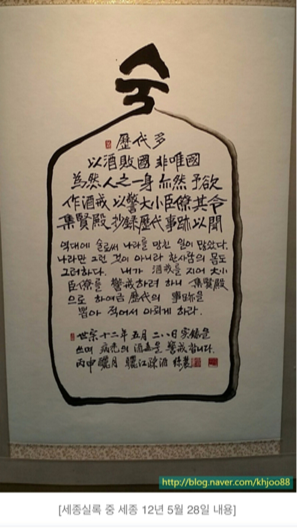

안녕하세요? 로버트입니다. 지금부터 발표를 시작하겠습니다. 발표 주제는 '세종대왕'입니다. 여러분은 '세종대왕'을 생각하면 무엇이 떠오릅니까? 오늘 여러분께 세종대왕에 대해 알지도 모르는 한 가지와 모를지도 모르는 두 가지를 말씀드리려고 합니다.

지금 보시는 것은 '훈민정음' 입니다. 혹시 이 특별한 책을 들어보신 적 있으십니까? 역사가들은 훈민정음이 세종대왕의 가장 빛나는 업적이라고 합니다. 백성들이 못 읽는 것을 깨달아서 세종대왕은 새로운 문자 체계를 만들기로 마음먹으셨습니다. 이 체계는 한글입니다. 이것으로 백성들이 읽고 쓰기 배울 수 있게 됐는데 500년이 넘은 지금도 한글 사용하고 있습니다.

다음 보시면 '세종대왕 출산휴가제도'가 있는데 자비로운 세종대왕 덕분에 어머니들은 출산 1달 전부터 쉬고 아기가 태아난 다음에 100일 휴가를 받았습니다. 나중에 아버지들도 산모를 돕도록 30일 휴가를 받습니다. 또한 세쌍동이가 태어나면 1년치 양식과 다름없는 양을 받았습니다.

마지막 사실은 세종대왕은 술 절대 안 드셨습니다. 건강을 위해 드시라고 부탁하더라도 약에 술을 넣으면 안 드셨습니다. 세종대왕은 축하하는 시간밖에 백성들은 술을 못 마셨다고 합니다. 이렇게 시행했던 제도는 금주령이었습니다.

여러분들 세종대왕에 대해 얼마나 알고 있습니까? 처음에는 세종대왕이 한글 만드셨고 업적이 많다고 아셨을텐데 여러분들 오늘 새로운 것을 배우셨기를 바랍니다. 이것으로 발표를 마치겠습니다. 들어 주셔서 감사합니다.