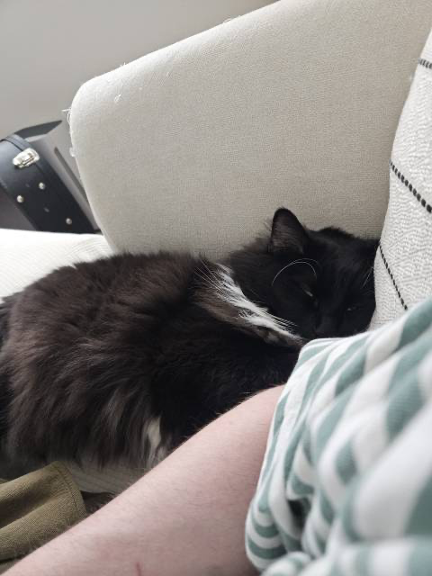
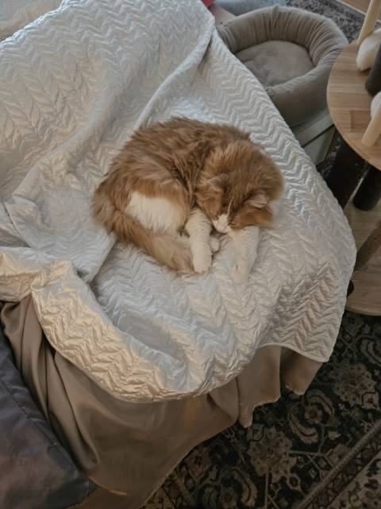

안녕하세요? 저는 로버트라고 합니다. 지금부터 제 소개를 시작하겠습니다.

첫번째로 저는 거의 10년 쯤 전에 아내와 만났는데 그 순간부터 지금까지 한국어를 공부하고 있습니다. 10년 쯤 공부했는데도 아직 한국어로 말하기 어렵습니다. 

| 이름  |         사진          |
| :-: | :-----------------: |
| 씨리  |   |
| 츄비  |   |
| 토시  |  |
| 매미  |  |

두 번째로 저는 고양이들이 정말 귀여워서 고양이 4마리를 입양했습니다. 우리 고양이들의 이름은 매미, 츄비, 토시, 마지막으로 씨리입니다. 츄비와 토시는 엄마가 같은데 씨리와 츄비 사이가 더 가깝습니다. 그런데 츄비는 평소에 씨리가 짜증나는 고양이라고 생각하는 것 같습니다. 우리 사랑스러운 고양이들은 귀엽고 친절한 고양이들입니다. 사실 우리 고양이들은 가끔 짜증날 정도로 방해합니다. 예를 들면 제가 일을 하려고 할 때 고양이들이 사무실로 와서 울기 시작합니다. 아시다시피 저는 고양이를 정말 좋아합니다.

마지막으로 제 전공은 컴퓨터 과학입니다. 마이크로소프트에서 엔지니어로 일하고 있는데 최근에 바빠져서 일하느라고 원하는 만큼 한국어를 공부하지 못하고 있습니다. 내년까지 집에서 일을 할 수 있지만 출근하기 싫어서 새 회사에 취직하려고 합니다.

이것으로 제 소개를 마치겠습니다. 들어 주셔서 감사합니다.