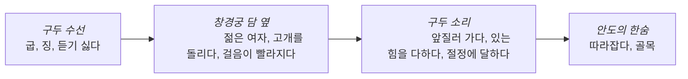

# 31
## 구두 수선을 맡겨 본 적이 있습니까?
* 이 남자에게 무슨 일이 있었는제 그림을 보고 추측해 보십시오.

글쓴이는 구두 소리 때문에 어떤 일을 경헙했습니까?
# 32
## 구두
구두 수선을 맡겼더니 뒷굽에 아주 큰 징을 한 개씩 박아 놓았다. 보기가 싫어서 빼 달라고 했더니 그런 징이 있어야 오래 신을 수 있다고 했다. 그래서 그대로 신기는 했지만 걸을 때마다 나는 소리가 아주 듣기 싫었다. 도로의 딱딱한 바닥에 부딪칠 때 나는 그 소리는 정말 듣기 싫었다.

그러던 어느 날 초저녁이었다. 좀 바쁜 일이 있어 창경궁 담 옆을 걸어 내려오는데 앞에서 걸어가던 어떤 젊은 여자가 살짝 고개를 돌려 나를 쳐다보더니 갑자기 걸음이 빨라졌다. 내 구두 소리에 놀란 것 같았다.

나는 그냥 그런가 보다 생각하고 내가 걸어야 할 길만 그대로 걷고 있었는데 얼마쯤 가다가 이 여자는 또 다시 뒤를 돌아본다. 그리고 자기와 나와의 거리가 가까워졌다는 것을 알고는 걸음이 아주 빨라졌다. 자기를 겁주려고 내가 그렇게 소리를 내며 걷는 줄 아는 것 같았다.

그러나 내가 일부러 내는 소리가 아니라고 이 여자한테 말해 줄 수도 없었다. 그래서 이 여자를 앞질러 가려고 더 빨리 걸었더니 여자도 더 빨리 걸었다. 내 발걸음이 좀 더 빨리졌다. 굽이 높은 구두를 신은 그 여자도 또각또각 있는 힘을 다해 걷는 것 같았다. 저녁 노을이 비치기 시작하는 도로 위에서 두 사람의 구두 소리는 절정에 달하고 있었다.

나는 이 여자의 뒤를 거의 다 따라갔다. 두세 걸음만 더 걸으면 이 여자를 앞지를 수 있었다. 그러나 이 여자 역시 있는 힘을 다해서 걸었다. 그래서 두세 걸음을 따라잡기가 쉽지 않았다. 내 걸음도 더욱 빨라졌는데 거기서 이 여자는 옆 골목으로 들어가 버렸다. 다행이었다. 안도의 한숨이 나왔다. 이 여자도 그랬을 것이다.

이 여자의 집이 그 골목 안에 있는지, 아니면 나를 피하려고 들어갔는지 알 수는 없었으나 나는 이 여자가 나를 이상한 사람으로 알고 있을 거라고 생각하니 서글펐다. 여자는 왜 그렇게 남자를 믿지 못 할까? 여자를 대할 때 남자는 구두 소리에도 주의를 해야 하는 것일까? 나는 그 다음날 구두 징을 빼 버렀다. 사람은 아주 사소한 것에 신경을 쓰며 살아야 된다는 것을 알게 되었다.
# 33
## 가
### 맞으면 O, 틀리면 X, 수 없으면 △ 하십시오
1. 글쓴이는 구두 뒷굽에서 나는 소리를 싫어했다
	1. O
2. 여자는 글쓴이가 겁주려고 일부러 구두 소리를 낸다고 생각하는 것 같다
	1. O
3. 글쓴이는 여자에게 일부러 구두 소리를 내는 것이 아니라고 말했다
	1. X, 글쓴이는 일부러 내는 소리가 아니라고 이 여자한테 말해 줄 수도 없었다고 했어요.
4. 글쓴이는 있는 힘을 다해 걸어서 여자를 앞질러 갔다
	1. X, 여자 역시 있는 힘을 다해서 걸었는데 두세 걸음을 따라잡기가 쉽지 않았다
5. 여자의 집이 골목 안에 있어서 그 여자는 골목으로 들어갔다
	1. △, 여자의 집이 그 골목 안에 있는지, 아니라고 했어요
## 나
### 묻고 대답하십시오
1. 구두를 수선하는 사람은 왜 구두 뒷굽에 큰 징을 박았다고 했어요?
	1. 그런 징이 있어야 오래 신을 수 있다고 했어요
2. 여자와 슬쓴이는 왜 빨리 걸었어요?
	1. 구두 소리에 놀란 것 같고 겁주려고 내가 그렇게 소릴 내며 걷는 줄 알고 여자를 앞질러 가려고 더 빨리 걸었더니 여자도 더 빨리 걸었다고 했어요
3. 글쓴이는 왜 서글프다고 했어요?
	1. 그 여자가 나를 이상한 사람으로 알고 있을 거라고 생각하니까 서글펐다고 했어요
4. 글쓴이는 이 일을 통해 무엇을 알게 됐다고 했어요?
	1. 사소한 것에 신경을 쓰며 살아야 된다는 것을 알게 되었다고 했어요
5. 글쓴이처럼 구두 소리 때문에 오해를 받으면 어떻게 할 거예요? (자기 생각을 말해 보세요.)
# 34
## 다
### 다음 단어와 표현을 이용해서 읽은 내용을 말해 보십시오

뒷굽에 아주 큰 징을 한 개씩 박아 놓았는데 지을 못 빼서 소리가 만들고 듣기 싫었다. 어느 날 한번은 
## 라
### 해 봅시다
#### 앞에서 읽은 내용을 자기 이야기처럼 친구에게 해 주세요
> *A*: 어제 기분 나쁜 일이 있었어요. 창경궁 담 옆길을 걷고 있는데.....
  *B*: 어제 집에 가는데 무서워서 죽는 줄 알았어요. 초저녁었는데....
#### 같이 이야기해 보세요. 여러분이 이런 상황에 여자/남자라면 어떻게 하겠어요?
## 마
### 써 봅시다
#### '라'에서 이야기한 내용을 쓰세요.